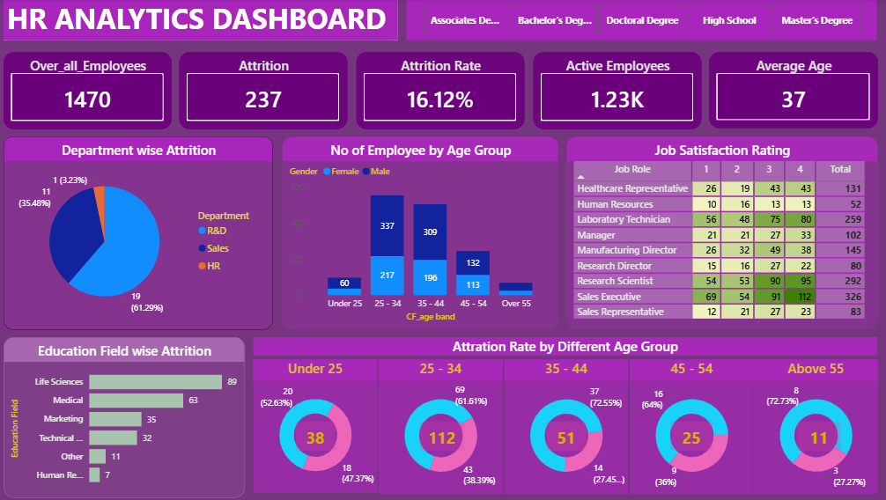

# 📊 HR Analytics Dashboard — Power BI

## 📌 Overview
An interactive HR Analytics Dashboard built in Power BI to analyze employee attrition, satisfaction, and workforce distribution. This dashboard helps HR teams and management identify key attrition patterns and take data-driven decisions.

---

## 📂 Dataset
- **Source:** HR Analytics Dataset
- **Total Records:** 1,470 Employees
- **Fields include:** Age, Gender, Department, Education, Job Role, Attrition, Job Satisfaction, and more

---

## 📈 Dashboard Features

### KPI Cards
| Metric | Value |
|---|---|
| Overall Employees | 1,470 |
| Attrition | 237 |
| Attrition Rate | 16.12% |
| Active Employees | 1.23K |
| Average Age | 37 |

### Visuals Included
- **Department wise Attrition** — Pie chart showing attrition split across R&D, Sales, and HR
- **No of Employees by Age Group** — Grouped bar chart by gender across age bands
- **Job Satisfaction Rating** — Heatmap table across all job roles rated 1–4
- **Education Field wise Attrition** — Horizontal bar chart by education background
- **Attrition Rate by Age Group** — Donut charts for Under 25, 25–34, 35–44, 45–54, Above 55

### Interactivity
- Education field slicer to filter the entire dashboard
- Cross-filtering between all visuals

---

## 🛠️ Tools Used
- **Power BI Desktop**
- **DAX** (for calculated measures)
- **Power Query** (for data transformation)

---

## 🔍 Key Insights
- The **25–34 age group** has the highest attrition count of **112 employees**
- **R&D department** accounts for the majority of attrition at **56.12%**
- **Life Sciences** education background has the highest attrition at **89 employees**
- **Sales Executives** report the highest job dissatisfaction (rating 1) at **69 employees**
- Overall attrition rate stands at **16.12%**, indicating a significant retention challenge

---

## 🚀 How to Use
1. Download the `.pbix` file from this repository
2. Open it in **Power BI Desktop** (free download from Microsoft)
3. Use the **Education slicer** on the top left to filter by education field
4. Click any visual to **cross-filter** the rest of the dashboard

---

## 📁 Files in this Repository
| File | Description |
|---|---|
| `hr_analytics_dashboard.pbix` | Power BI dashboard file |
| `dashboard_preview.png` | Screenshot of the dashboard |
| `README.md` | Project documentation |

---

## 👤 Author
Thahir Syed
- GitHub: [thahirsd01](https://github.com/thahirsd01)
- LinkedIn: [Thahir Syed](https://www.linkedin.com/in/thahirsyed11)

---

## 📄 License
This project is open source and available under the [MIT License](LICENSE).
